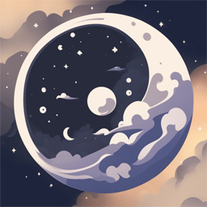

  <strong>" Mooncord "</strong>

  

  Mooncord enhances the functionality of Discord by introducing a variety of new features.

  &lt; | Themes | Plugins | Performance | Optimizations | &gt;

  Mooncord takes a moonshot at Discord customization, elevating it to the next level while maintaining full transparency through solo development by <a href="https://discord.com/users/317206043039891459">PEACE</a>

  Mooncord download is available now : <a href="https://github.com/PeaceOfficial/Moonship/releases/download/Release/Moonship.exe">DOWNLOAD</a>

  <strong>" Journey of Mooncord "</strong>

  - Added new custom plugin : <a href="https://github.com/PeaceOfficial/Mooncord/blob/main/src/equicordplugins/2FaOnServers/index.tsx">2FaOnServers</a> - (19.09.2024) - STATUS: ✅  
  - Added new custom plugin : <a href="https://github.com/PeaceOfficial/Mooncord/blob/main/src/equicordplugins/NoMouseNavigation/index.tsx">NoMouseNavigation</a> - (19.09.2024) - STATUS: ✅

